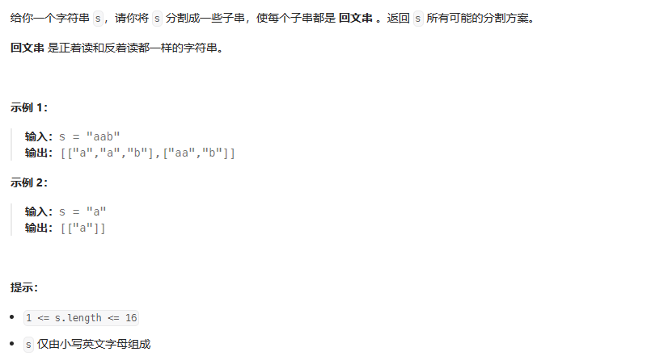

#理论基础
## 什么是回溯
回溯法也可以叫做回溯搜索法，它是一种搜索的方式。  
回溯是递归的副产品，只要有递归就会有回溯
## 回溯法的效率
回溯法的本质就是穷举，穷举所有可能，然后选出想要的答案。可以添加剪枝操作，优化回溯，但无法改变回溯是穷举的本质。
## 回溯法解决的问题
回溯法，一般可以解决如下几种问题：

- 组合问题：N个数里面按一定规则找出k个数的集合
- 切割问题：一个字符串按一定规则有几种切割方式
- 子集问题：一个N个数的集合里有多少符合条件的子集
- 排列问题：N个数按一定规则全排列，有几种排列方式
- 棋盘问题：N皇后，解数独等等

组合是不强调元素顺序的，排列是强调元素顺序。  
例如：{1, 2} 和 {2, 1} 在组合上，就是一个集合，因为不强调顺序，而要是排列的话，{1, 2} 和 {2, 1} 就是两个集合了。  

## 回溯法模板
- 解决回溯问题需要思考的 3 个问题：
  
  路径：已经做出的选择  
  选择列表：当前可以做的选择  
  结束条件：到达决策树底层，无法再做选择的条件

- 回溯三部曲
    1. 回溯函数模板返回值以及参数
        - 回溯函数名一般命名为backtracking   
        - 返回类型一般为void
        - 参数在写完逻辑后再确定
        
    2. 回溯函数终止条件  
        什么时候达到了终止条件，树中就可以看出，一般来说搜到叶子节点了，也就找到了满足条件的一条答案，把这个答案存放起来，并结束本层递归  
          伪代码如下：  

             if (终止条件) { 
                 存放结果;  
                 return;   
             }
    3. 回溯搜索的遍历过程  
        回溯法一般是在集合中递归搜索，集合的大小构成了树的宽度，递归的深度构成的树的深度。
          

            for (选择：本层集合中元素（树中节点孩子的数量就是集合的大小）) {  
                处理节点;  
                backtracking(路径，选择列表); // 递归 
                回溯，撤销处理结果 
            }  
        for循环就是遍历集合区间，可以理解一个节点有多少个孩子，这个for循环就执行多少次。  
        backtracking这里自己调用自己，实现递归。  
        for循环可以理解是横向遍历，backtracking（递归）就是纵向遍历
    4. 最终模板  
    
            void backtracking(参数) {
                if (终止条件) {  
                    存放结果;  
                    return;  
                }  
            
                for (选择：本层集合中元素（树中节点孩子的数量就是集合的大小）) {
                    处理节点;
                    backtracking(路径，选择列表); // 递归
                    回溯，撤销处理结果
                }
            }
#### 例题
- leetcode 131 分割回文串
  
