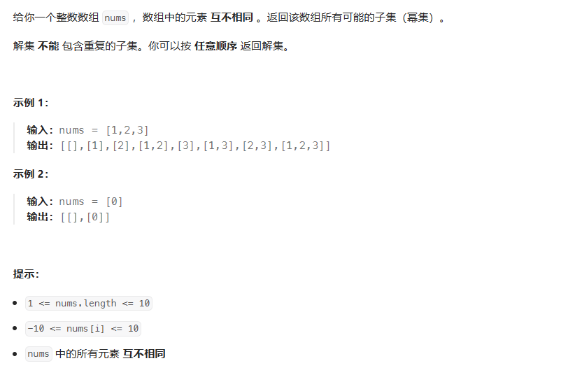

# 位运算理论
    java将一个整数转为二进制数：Integer.toBinaryString()
## 集合压缩
    - 集合可以用二进制表示，二进制从低到高第i位为1表示i在集合中，为0表示i不在集合中。
    - 实现原理：binaryNum ^= 1 << e (binaryNum为压缩的二进制数，e为集合中的元素）
  

## 集合与集合
  

            int[] set1 = {0, 1, 2, 5, 4, 7}; //集合中的元素互斥
            int[] set2 = {1, 2, 3, 4, 6, 8};
            int s1 = compressSet(set1);
            int s2 = compressSet(set2);
            int s3 = s1 & s2; //求两个集合的交集
            int s4 = s1 | s2; //求两个集合的并集
            int s5 = s1 ^ s2; //求两个集合的对称差，即两个集合的并集除两个集合的交集外
            int s6 = s1 & ~s2;//求集合1和集合2的差
            System.out.println("s1: " + Integer.toString(s1, 2) + " s2: " + Integer.toString(s2, 2) + " s3: " + Integer.toString(s3, 2));
            System.out.println("s1: " + Integer.toString(s1, 2) + " s2: " + Integer.toString(s2, 2) + " s4: " + Integer.toString(s4, 2));
            System.out.println("s1: " + Integer.toString(s1, 2) + " s2: " + Integer.toString(s2, 2) + " s5: " + Integer.toString(s5, 2));
            System.out.println("s1: " + Integer.toString(s1, 2) + " s2: " + Integer.toString(s2, 2) + " s6: " + Integer.toString(s6, 2));
            s1: 10110111 s2: 101011110 s3: 10110
            s1: 10110111 s2: 101011110 s4: 111111111
            s1: 10110111 s2: 101011110 s5: 111101001
            s1: 10110111 s2: 101011110 s6: 10100001  
            
## 集合与元素  
 
 
    
## 刷题笔记

 
 
 
    解法一：回溯
    解法二：位运算  
    
解法二：
     
   代码见BitwiseOperations.subsets
   
       api用法：public static int numberOfLeadingZeros(int k) {} 返回为1的最高位前面零的位数  
       例如：10的二进制位：00000000000000000000000000001010 则 Integer.numberOfLeadingZeros(10) 的返回值为 28
