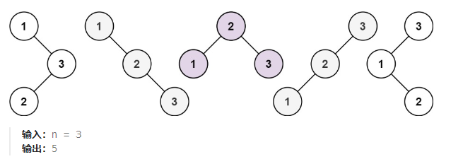
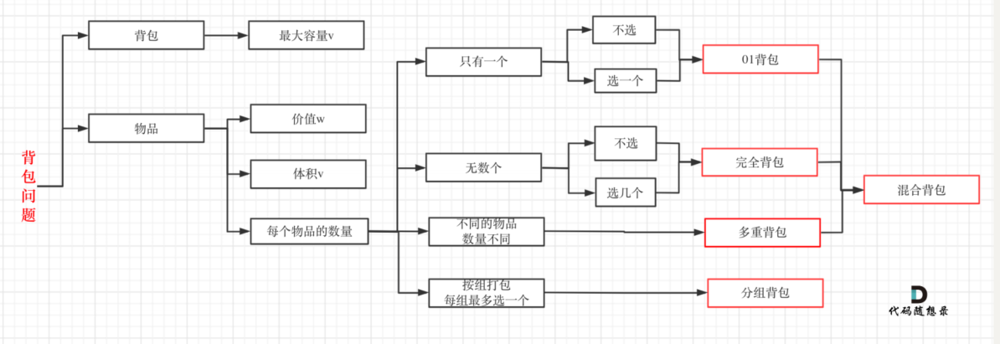
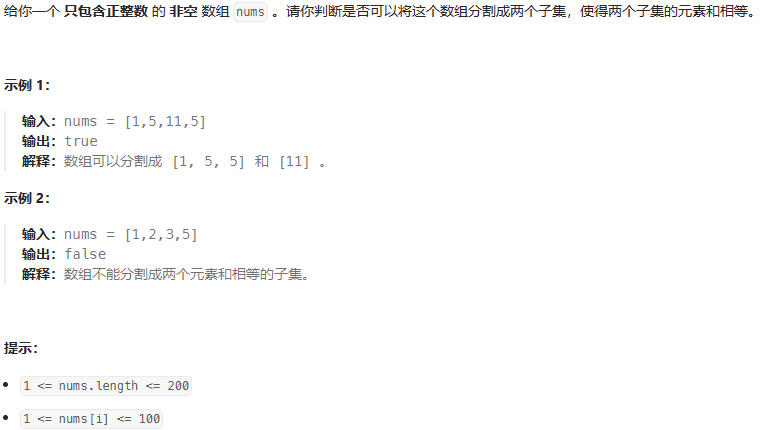
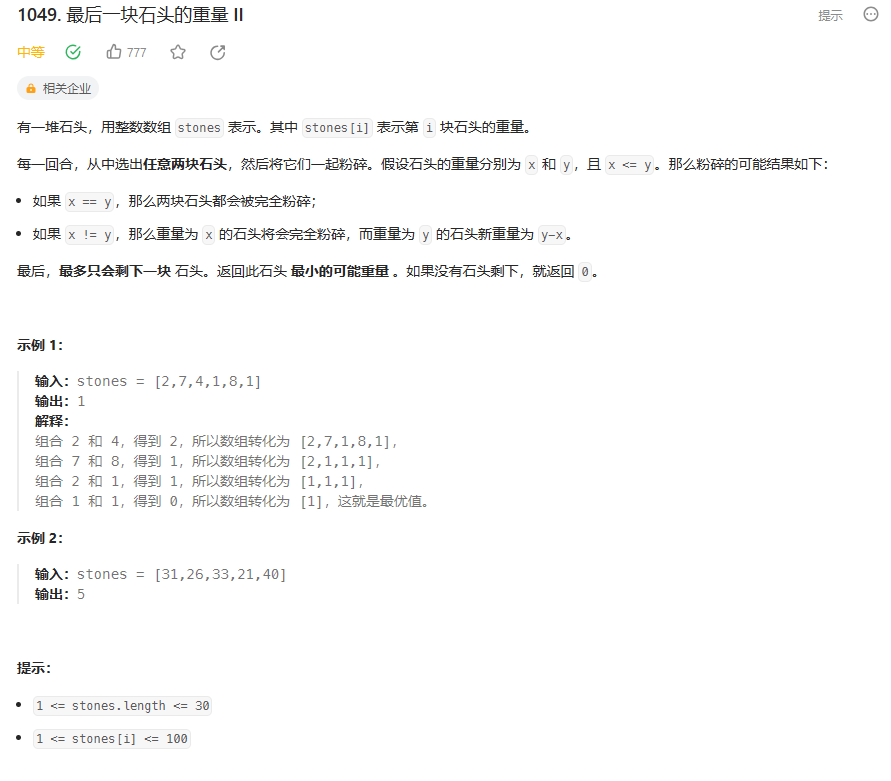

# 动态规划
## 动态规划解题套路  
首先，动态规划问题的一般形式就是求最值。动态规划其实是运筹学的一种最优化方法，只不过在计算机问题上应用比较多，比如说让你求最长递增子序列呀，最小编辑距离呀等等

既然是要求最值，那么核心问题是什么呢？求解动态规划的核心问题是穷举。因为要求最值，肯定要把所有「可行解」穷举出来，然后在其中找到「最优解」

但是，如果只是无脑穷举，那么肯定效率极其低下！因为动态规划问题具有一些特殊的特点，可以让我们的穷举变得「聪明」一点

首先，我们来介绍动态规划的三个特点：

- 存在「重叠子问题」：当处理规模为n的问题时，中间可能需要处理多个相同且规模为n - i的问题  
- 具备「最优子结构」：问题n = {n1, n2, n3}, 问题n的最优解当且仅当问题n1, n2, n3为最优解时取得；换句话说，我们可以通过求子问题的最优解，来得到问题 
 的最优解
- 正确的「状态转移方程」
由于存在「重叠子问题」，所以我们可以通过「备忘录」或者「DP table」来优化穷举过程，避免不必要的计算  

## 动态规划的解题步骤
1. 确定子问题
2. 确定dp数组(dp table)以及下标含义
3. 确定子问题递推关系
4. dp数组如何初始化
5. 确定遍历顺序
6. 举例推导dp数组
7. 空间优化

## 做题笔记
 
### 整数拆分（leetcode 343）
    - 描述：给定一个正整数 n，将其拆分为至少两个正整数的和，并使这些整数的乘积最大化。 返回你可以获得的最大乘积。
        - 示例 1:
            输入: 2  
            输出: 1  
            解释: 2 = 1 + 1, 1 × 1 = 1。  
        - 示例 2:
            输入: 10  
            输出: 36  
            解释: 10 = 3 + 3 + 4, 3 × 3 × 4 = 36。  
            说明: 你可以假设 n 不小于 2 且不大于 58。
    - 算法实现步骤：
        1. 确定dp数组以及下标含义：这里dp[i]指数字i的拆解后的最大乘积值。
        2. 确定递推公式：手动模拟出dp[i]的值，找到对应的关系，确定dp[i]如何才能最大。
            - 递推公式：dp[i] = max({dp[i], (i - j) * j, dp[i - j] * j});
            - 为什么不和dp[i - j] * dp[j]作比较，是因为j从1开始遍历，dp[i - j]已经计算过j的最大乘积。（时刻记住dp[i]的含义）
        3. 初始化 dp[2] = 1
        4. 确定遍历顺序。从3开始遍历
    - 代码实现：见DynamicProgramming.integerBreak.
### 不同的二叉搜索树（leetcode 96）

    - 描述：给你一个整数 n ，求恰由 n 个节点组成且节点值从 1 到 n 互不相同的 二叉搜索树 有多少种？返回满足题意的二叉搜索树的种数。
        - 示例 1:
     
       
    - 算法实现步骤：
        1. 确定dp数组以及下标含义：这里dp[i]指i个结点可以组成的二叉树搜索树的种数。
        2. 确定递推公式：手动模拟出dp[i]的值，找到对应的关系，确定dp[i]与前面的i个节点的递推关系式。
            - 递推公式：dp[i] += dp[j - 1] * dp[i - j];
            - 当n取值6时，以6为头结点，此时其他5个结点只能出现在头结点的左边，而这5个节点对应的二叉搜索树的种数即为dp[5]，同理当
               以5为头结点时，左边有4个结点，4个结点对应的种数为dp[4],右边只能放数字为6的这个结点，1个结点对应种数为dp[1]
               所以5为头结点对应的二叉搜索树的种数为dp[4]*dp[1],...经归纳推理可得递推公式为：dp += dp[j - 1]*dp[i - j]
        3. 初始化 dp[0] = 1 dp[1] =  1 dp[2] = 2
        4. 确定遍历顺序。从3开始遍历
    - 代码实现：见DynamicProgramming.numTrees.
  
### 背包问题
 
    - 背包理论基础
    
    - 背包理论基础（滚动数组）：需要满足的条件是上一层可以重复利用，直接拷贝到当前层。  
    - 分割等和子集  
    - 最后一块石头的重量II  
    - 目标和  
    - 一和零  
#### 01背包问题 
    1. 有N件物品和⼀个最多能背重量为W 的背包。第i件物品的重量是weight[i]，得到的价值是
    value[i] 。每件物品只能⽤⼀次，求解将哪些物品装⼊背包⾥物品价值总和最⼤。
    代码见DynamicProgramming.01背包问题（ACM模式)
   - 分割等和子集  
        - 分析：数组分割成两个子集，使得子集的元素和相等。将这个问题抽象为01背包问题，首先数组需要满足和为偶数，这样才能分割，否则无法分割。  
        在这个问题中，背包体积为数组元素和sum的一半，记为target，数组长度length对应length件物品，weight[i]对应每个元素的大小，value[i]  
        对应每个元素的大小，每个元素只能取一次。  
   
   
    代码分析见DynamicProgramming.canPartition
   - 最后一块石头的重量II  
   
        - 分析：根据题目中的描述，每个回合粉碎两块石头。最后最多只会剩下一块石头，返回石头最小的可能重量。  
        将这个问题抽象为01背包问题，意思是将这些石头分为重量相等或相近的两部分，所有石头重量记做sum，取sum的一半作为target  
        target即为背包的体积，weight[i]对应每个石头的大小，value[i]对应每个石头的大小。最后结果为sum - dp[target]*2。
        代码见DynamicProgramming.lastStoneWeightII  
#### 01背包问题总结
- 问题往往需要抽象为01背包问题的形式  
- 常见变形：  
   - 至多装capacity，求方案数/最大价值和
   - 恰好装capacity，求方案数/最大/最小价值和
   - 至少装capacity，求方案数/最小价值和
- 在二维dp解法中，外层循环和内层循环遍历顺序是随意的，一般遍历物品比较好理解；而在一维dp解法中，首先是内层循环必须是遍历背包容量，且按大到小
遍历，否则会导致，一个物品被多次选择；另外外层循环必须是遍历物品而内层循环必须是遍历背包容量，否则如果先遍历背包容量，这时候会导致，
每个对应的背包容量每一次只会选择一个物品。

#### 完全背包问题
完全背包问题和01背包问题的本质区别在于完全背包问题可以多次选择同一物品，01背包问题只能选择一次同一物品
在使用一维dp数组解决该问题时，只需要将01背包中遍历背包容量的顺序倒过来即可，即由小到大进行遍历。
但有的题型需要对先遍历谁做出调整

- 零钱兑换II  
  
分析：本题为完全背包问题，可以多次重复选择同一物品，直到装满背包，在装满背包的过程中与选择物品的顺序无关
动态规划五部曲进行分析如下：  
    - 确定dp数组下标含义：有题意可知，dp[j]代表背包容量为j时，装满背包选择物品的组合个数。
    - 确定递推公式：根据分析可知，当有i个物品可以选择时，如果j >= 物品的重量时：
        - dp[j] = dp[j - 第i个物品的重量] + 上一轮的组合数（即只有i - 1个物品可以选择时的组合数）  
        ps：dp[j - 第i个物品的重量]已经在之前计算好了
        - 递推公式为：dp[j] += dp[j - coins[i]]
    - 初始化dp数组：当j = 0时，初始化dp[0] = 1,因为后面的dp[j]的计算都是基于dp[0]的，具体问题具体分析。
    - 确定遍历顺序：在使用一维dp数组解决背包问题时，特别需要注意遍历顺序。  
        在本题中先遍历物品在从小到大遍历背包，以便实现多次选择同一物品。
    - 推导dp数组:
    代码见DynamicProgramming.change
- 组合总和IV
 
分析：本题为完全背包问题，可以多次重复选择同一物品，直到装满背包，在装满背包的过程中与选择物品的顺序有关
本题与上一题的不同之处在于它与选择物品时的顺序有关，抽象为物品的排列问题
与只需要将上一题的遍历顺序进行更改即可，先遍历背包，在遍历物品，外循环为遍历背包从小到大，内循环遍历物品从小到大
代码见DynamicProgramming.combinationSum4  
**NOTICE**：  
   - 如果求组合数就是外层for循环遍历物品，内层for遍历背包。  
   - 如果求排列数就是外层for遍历背包，内层for循环遍历物品。

 
分析：
 - dp[i]代表有0-i家可以偷窃时，最高可以偷窃的金额
 - dp递推公式（状态方程分析）根据题意，dp[i]可以有dp[i - 1] 和dp[i - 2] + nums[i - 1]而来，只需比较两者的大小即可;(选择打劫第i家和不选择打劫第i家)
 - dp初始化 dp[0] = 0, dp[1] = nums[0];
 - dp遍历顺序
 - 推导dp数组
 代码见DynamicProgramming.rob
