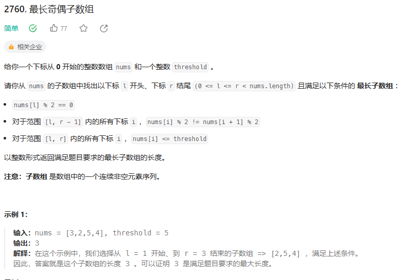

### 分组循环模板
    n = len(nums)
    i = 0
    while i < n:
        start = i
        while i < n and ...:
            i += 1
        # 从 start 到 i-1 是一组
        # 下一组从 i 开始，无需 i += 1

### 例题
 

#### 题意解读  
选一个最长连续子数组，满足子数组元素依次是偶数，奇数，偶数，奇数，……，且元素值均不超过 `threshold`。

例如 `nums=[2,1,1,4,3,4,2,8]`,`threshold=5`，数组可以分成` [2,1],1,[4,3,4],[2],8`，其中 `[⋯ ] `是子数组，其余数字不满足要求。
所以最长连续子数组的长度是 `3`。

#### 分组循环
适用场景：按照题目要求，数组会被分割成若干组，且每一组的判断/处理逻辑是一样的。

核心思想：

外层循环负责遍历组之前的准备工作（记录开始位置），和遍历组之后的统计工作（更新答案最大值）。
内层循环负责遍历组，找出这一组最远在哪结束。
这个写法的好处是，各个逻辑块分工明确，也不需要特判最后一组（易错点）。

代码见GroupLoops.longestAlternatingSubarray1

