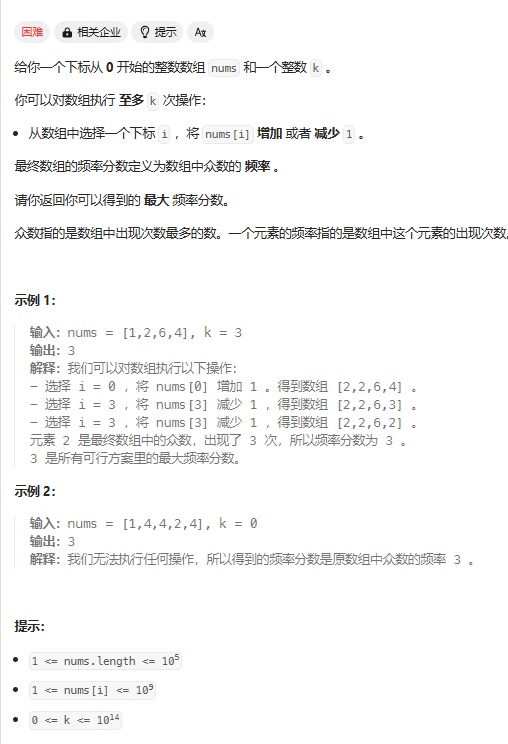
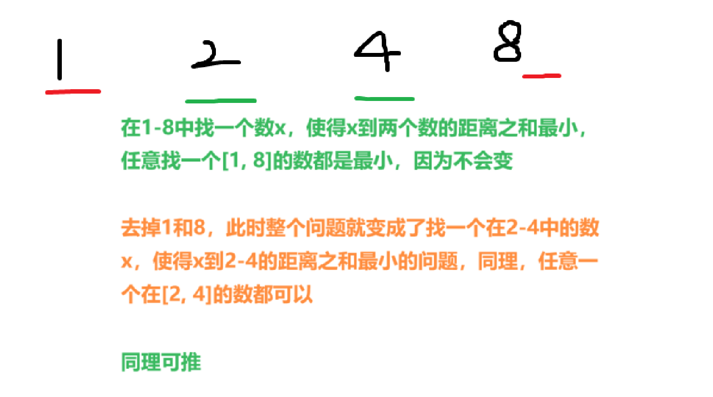

# 数论相关知识与题型

### leetcode 2926.执行操作使频率分数最大
    
   
   
    前要知识：一个有序数组，找到一个数x，使得数组所有元素e，满足|e - x|的和最小
    x为这个数组的中位数,如果存在两个中位数a,b，那么x为[a, b]之间的任意一个数都成立，包括a，b；
    证明：假设有两个数a，b（a < b),那么在（a, b)区间取任意一个数x，a到x的距离加b到x的距离都相等
    再假设c，d为区间（a，b）中的数且满足a < c < d < b,那么在a，b中找一个数x使得到这四个数的距离最短，只要x取c、d或者cd之间即可
    同理推得 x就是中位数  
   
        
       思路：前缀和 + 滑动窗口
       public int maxFrequencyScore(int[] nums, long k) {
               // 前要知识：中位数贪心
               //第一种做法：前缀和+滑窗
               int n = nums.length;
               Arrays.sort(nums);
               long[] pre = new long[n + 1];
               for (int i = 1; i <= n; i++) {
                   pre[i] = pre[i - 1] + nums[i - 1];
               }
               int r = 0, l = 0, ans = 0;
               while (r < n) {
                   while (operation(pre, nums, r, l) > k) {
                       l++;
                   }
                   ans = Math.max(ans, r - l + 1);
                   r++;
               }
               return ans;
       
           }
           public long operation(long[] pre, int[] nums, int r, int l) { 
               int i = (r + l) / 2;
               long left = (i - l) * nums[i] - (pre[i] - pre[l]);
               long right = (pre[r + 1] - pre[i + 1]) - nums[i] * (r - i);
               return left + right;
           }
   
    

