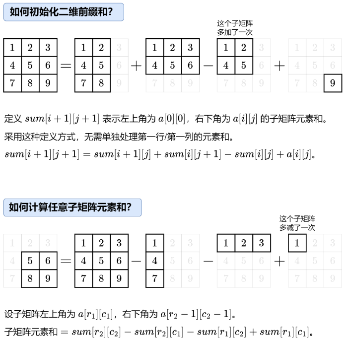

# 前缀和

## 一维前缀和
    定义：子数组（i, j)的和为 sum(i, j) = prefixSum[j] - prefixSum[i - 1]
## 二维前缀和
  

### 题目清单：

    3212. 统计 X和Y频数相等的子矩阵数量 
    1277.统计全为 1 的正方形子矩阵
    221. 最大正方形
    304. 二维区域和检索-矩阵不可变
    1504. 统计全 1 字矩形
