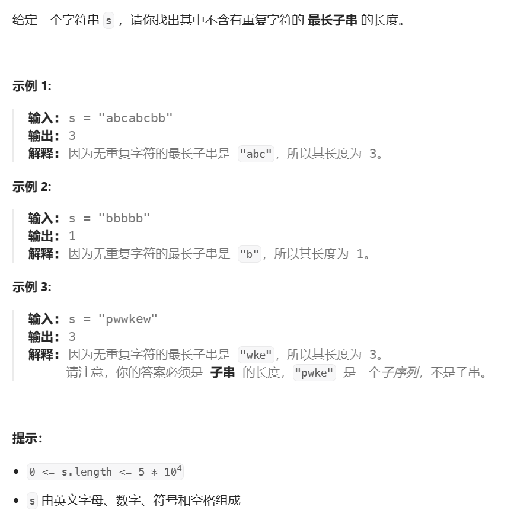

## 滑动窗口
### 什么是滑动窗口？  
    一种解题思路，窗口大小动态变化，窗口中的元素始终符合题目要求
## 例题

---------------------------
###. leetcode 3. 无重复字符的最长字串  
     
 - 思路  
    - 使用两个指针表示字符串中的某个子串（或窗口）的左右边界，其中左指针代表着上文中「枚举子串的起始位置」，而右指针即为上文中的 rk；
      
    - 在每一步的操作中，将左指针向右移动一格，表示 开始枚举下一个字符作为起始位置，然后可以不断地向右移动右指针，但需要保证这两个指针
    对应的子串中没有重复的字符。在移动结束后，这个子串就对应着 以左指针开始的，不包含重复字符的最长子串。记录下这个子串的长度； 
     
    - 在枚举结束后，找到的最长的子串的长度即为答案。  
    
    - 代码见slide_window.SlideWindow.lengthOfLongestSubstring
      
### 滑动窗口题单  
   #### 不定长滑动窗口（求最长/最大）
            3. 无重复字符的最长子串
            2958. 最多K个重复元素的最长子数组
            1493. 删掉一个元素以后全为 1 的最长子数组 
            904. 水果成篮 
            1695. 删除子数组的最大得分 
            2841. 几乎唯一子数组的最大和 
            2024. 考试的最大困扰度 
            1004. 最大连续1的个数 III 
            1438. 绝对差不超过限制的最长连续子数组 
            2401. 最长优雅子数组 
            1658. 将 x 减到 0 的最小操作数 
            1838. 最高频元素的频数 
            2831. 找出最长等值子数组 
            2106. 摘水果 
            1610. 可见点的最大数目 
            395. 至少有 K 个重复字符的最长子串
            1763. 最长的美好子字符串
            2953. 统计完全子字符串
            159. 至多包含两个不同字符的最长子串（会员题）
            340. 至多包含 K 个不同字符的最长子串（会员题）
#### 不定长滑动窗口（求最短/最小）
        209. 长度最小的子数组
        1234. 替换子串得到平衡字符串 1878
        1574. 删除最短的子数组使剩余数组有序 
        76. 最小覆盖子串
#### 不定长滑动窗口（求子数组个数）
        2799. 统计完全子数组的数目 1398
        713. 乘积小于 K 的子数组
        1358. 包含所有三种字符的子字符串数目 1646
        2302. 统计得分小于 K 的子数组数目 1808
        2537. 统计好子数组的数目 1892
        2762. 不间断子数组 1940
        2743. 计算没有重复字符的子字符串数量（会员题）
        2962. 统计最大元素出现至少K次的子数组
#### 多指针滑动窗口
        930. 和相同的二元子数组 1592
        1248. 统计「优美子数组」 1624
        2563. 统计公平数对的数目 1721
        1712. 将数组分成三个子数组的方案数 2079
        2444. 统计定界子数组的数目 2093
        992. K 个不同整数的子数组 2210