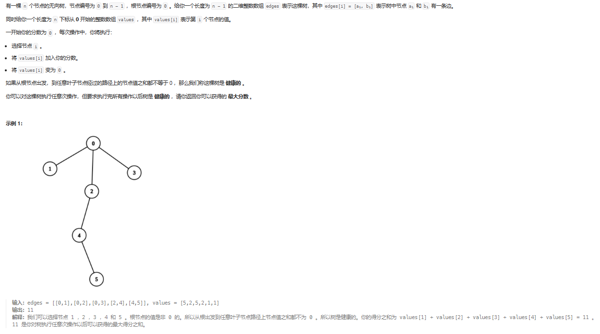

# 树形dp问题

## 模板（待总结）

## 做题分析

- leetcode 第2925题 在树上执行操作以后得到的最大分数  

   

    问题难点:  
        1. 如何从一个二维数组构造图   
        2. 如何从问题中分解出子问题  
        3. 如何在解题中正确使用递归
        
    难点解决：
        1. 使用一个下标从0开始的二维数组来记录每个节点和哪些节点之间有边
            在java中使用动态数组有利于增加操作：List<Integer>[] graph = new ArrayList[length];
            解释：创建一个ArrayList类型的数组，数组对应的下标代表当前节点编号，其中数组中的每个元素都是一个动态数组，用于存储与之相连接
            的节点。
            
        2. 该问题在于找到一个最小的损失（也就是获得最大分数）保证这棵树是健康的：对于每条根节点到叶子节点的路径中，只需要保证其中有
        一个节点没有被选。
            子问题分解：从一个节点（假设该节点为根节点）开始，两种可能，选或者不选。
                选的话，如果该根节点的孩子节点是叶子节点，那么孩子节点都不可选，此时的损失为所有孩子节点价值之和；
                选的话，损失为根节点的价值。（如果孩子节点不是叶子节点，则做同样的判断，选当前节点的损失和不选的损失，谁更小）
               
                取两者之间的最小值，则代表损失最小，此时获得分数最大。
        3. 代码见DpTree.maximumScoreAfterOperations1