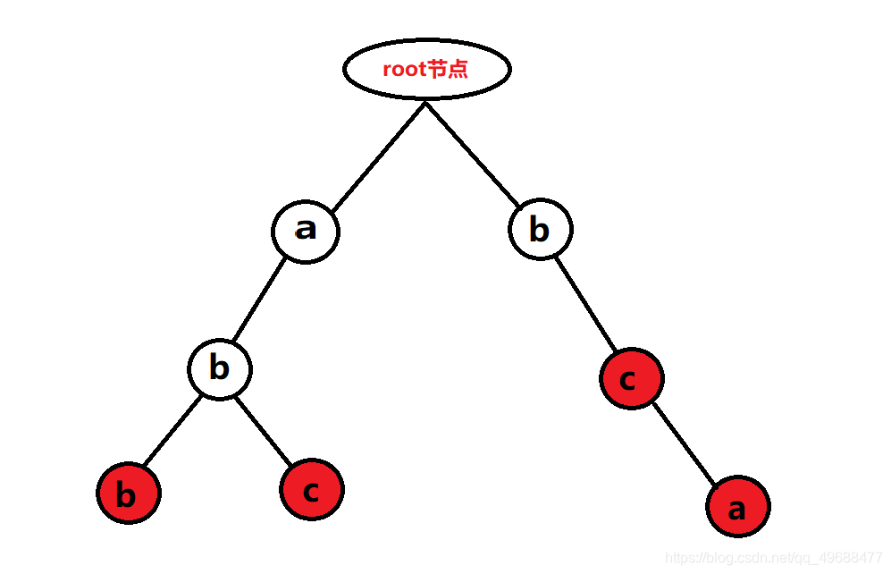
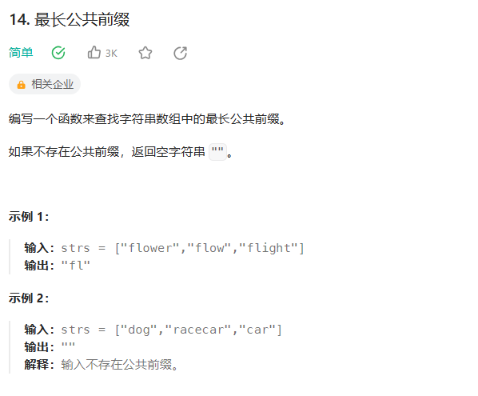
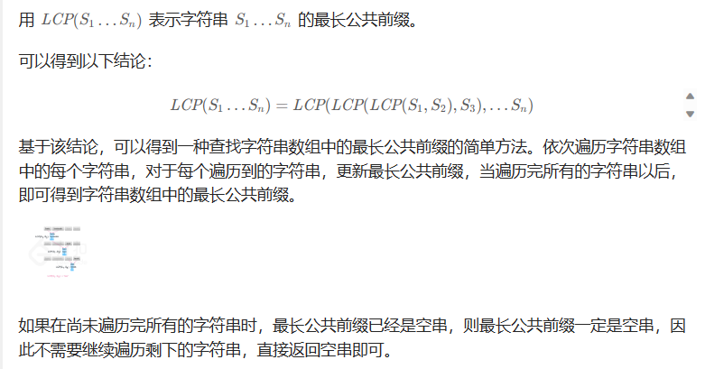
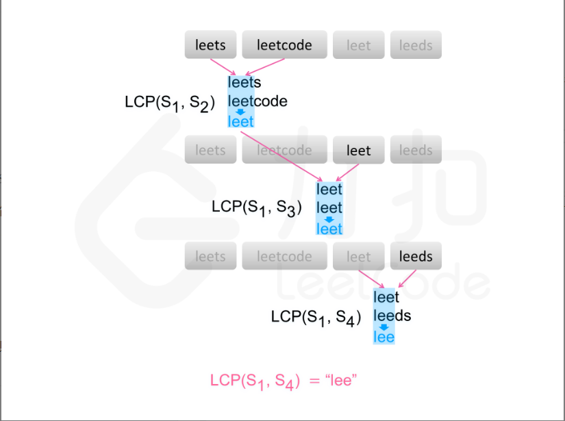

# 字典树（前缀树）
## 学习目标
- 字典树的基本概念？
- 字典树的应用场景？  
- 字典树的具体实现？
## Introduce
字典树也叫**Trie**树、前缀树，它是一种树形结构，是对于字典的一种存储方式（数据结构），
主要用于统计，排序和保存大量的字符串(但不仅限于字符串，如01字典树)。
主要思想是利用字符串的公共前缀来节约存储空间。很好的利用串的公共前缀，节约了存储空间。字典树主要包含两种操作，**insert**和**find**。  

代码见trieTree.TrieTree

***
### leetcode 14 最长公共前缀
  
- 字典树解法  
                    
        思路：通过构造字典树，遍历字符串数组，插入一个字符串，统计字符串对应的字符出现的次数，第一个字符串不统计。  
***
        代码如下：
        int maxPrefixLen = 0;//记录字典树插入字符串过程中，公共前缀的长度。
        class Trie { //定义一个字典树
            private Trie[] children;
            private int count;//记录每个字符串中字符出现的次数
            public Trie() {
                children = new Trie[26];
            }
            public void insert(String s, int len) {
                Trie cur = this;
                for (int i = 0; i < s.length(); i++) {
                    char c = s.charAt(i);
                    int index = c - 'a';
                    if (cur.children[index] == null) cur.children[index] = new Trie();
                    else cur.children[index].count++; 
                    if (cur.children[index].count == len - 1) maxPrefixLen++;//第一个不统计，插入最后一个字符串时，公共前缀的长度为字符串数组长度减1
                    cur = cur.children[index];
                }
            }
        }
        public String longestCommonPrefix(String[] strs) {
            Trie cur = new Trie();
            for (int i = 0; i < strs.length; i++) {
                String s = strs[i];
                if (s == "") {
                    return "";
                }
                cur.insert(s, strs.length);
            }
            //插入结束，得出最大公共前缀长度
            return strs[0].substring(0, maxPrefixLen);
        }

- 其他解法：横向扫描  
      
      
    
    
            public String longestCommonPrefix(String[] strs) {
                if (strs == null || strs.length == 0) {
                    return "";
                }
                String prefix = strs[0];
                int count = strs.length;
                for (int i = 1; i < count; i++) {
                    prefix = longestCommonPrefix(prefix, strs[i]);
                    if (prefix.length() == 0) {
                        break;
                    }
                }
                return prefix;
            }
        
            public String longestCommonPrefix(String str1, String str2) {
                int length = Math.min(str1.length(), str2.length());
                int index = 0;
                while (index < length && str1.charAt(index) == str2.charAt(index)) {
                    index++;
                }
                return str1.substring(0, index);
            }

    

