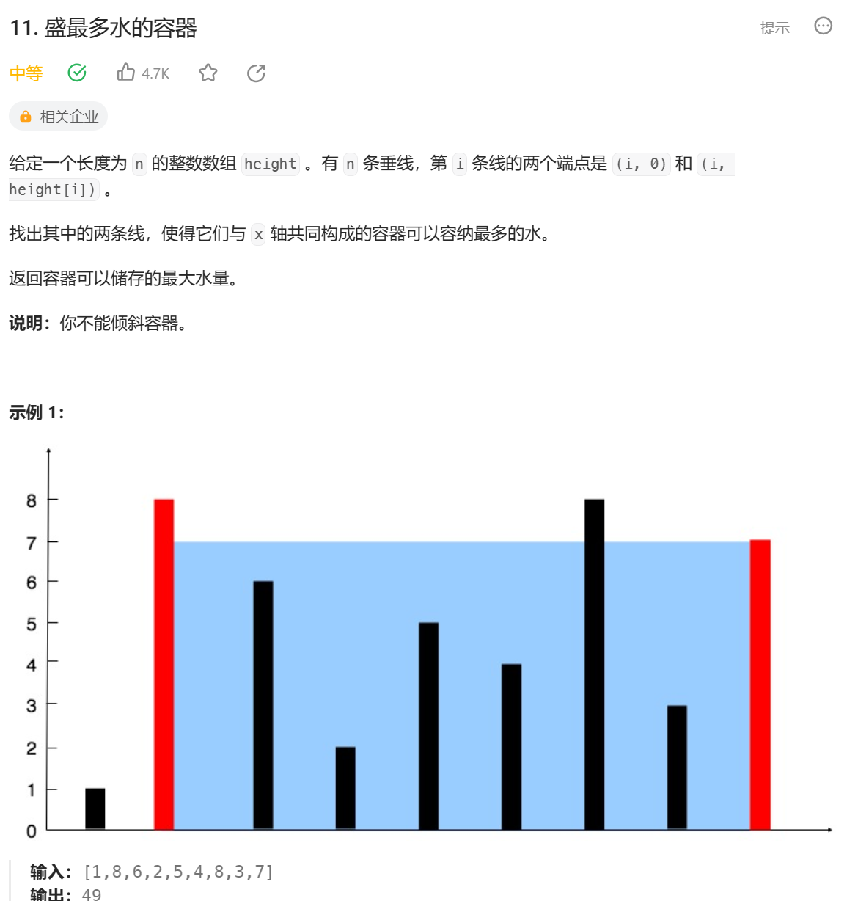
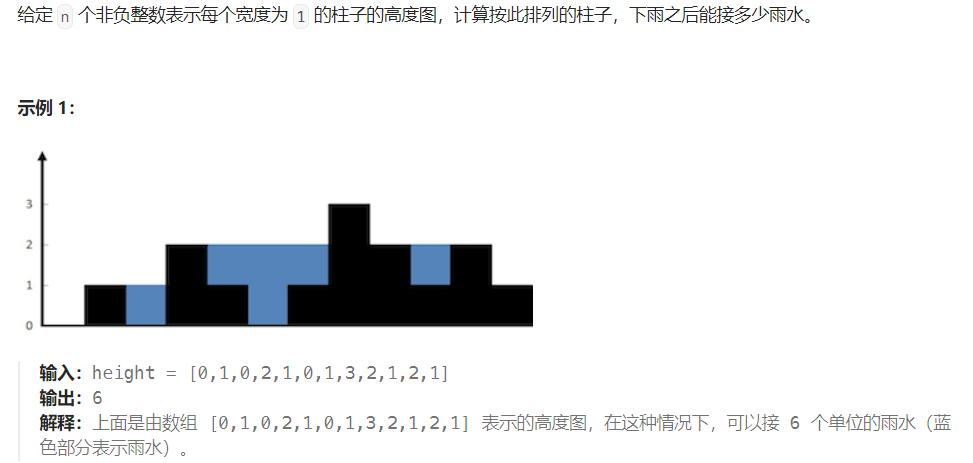

# 双指针

***  
## 1. 相向双指针

### leetcode 11.盛最多水的容器
 


    1 做题分析：根据题意，需要找到其中两条线，使得容器可以容纳最多的水,容易想到使用双指针解法。  
    分析可知体积与两指针指向高度最小值和两个指针的距离相关。  
    初始化两个指针，l = 0，r = n - 1，此时对应最大能容纳水的体积为min(h[l], h[r]) * (r - l)
    移动指针时，选择移动更小的那个指针，如果移动更大的，体积不会增加，只会减少，计算体积时，高度始终是左右两个高度中最小的那个，
    所以移动高度更高的指针使得两个指针的距离减少，而高度始终是取最小值，从而体积减少。
    2 结论：每一次比较左右高度，移动高度小的那个，如果左右高度相等，随便选择移动一个即可
    代码见TowPointers.maxArea

### leetcode 167.两数之和 2-输入有序数组

    题意：给你一个下标从` 1` 开始的整数数组`numbers`，该数组已按非递减顺序排列，请你从数组中找出满足相加之和等于目标数`target` 的两个数。
    如果设这两个数分别是`numbers[index1]` 和`numbers[index2]`，则 1 <= index1 < index2 <= numbers.length 。
    以长度为 2 的整数数组 [index1, index2] 的形式返回这两个整数的下标 index1 和 index2。
    你可以假设每个输入 只对应唯一的答案 ，而且你 不可以 重复使用相同的元素。
    你所设计的解决方案必须只使用常量级的额外空间。


#### 代码实现：
```java
public int[] twoSum(int[] numbers, int target) {
    int n = numbers.length;
    int l = 0, r = n - 1;
    while (l < r) {
        // 如果大于 target 则把 r 向右移动
        while (numbers[l] + numbers[r] > target) {
            r--;
        }
        // 不大于 target 时，如果等于则直接返回
        if (numbers[r] + numbers[l] == target) return new int[] {l + 1, r + 1};
        // 否则小于的话让 l 左移
        l++;
    }
    return new int[] {l + 1, r + 1};
}
```

### leetcode 15. 三数之和


### leetcode 42. 接雨水

 

     解题思路：维护两个指针 l 和 r, p_max 记录前缀最高的柱子高度, s_max 记录后缀最高的柱子高度.
     初始时, l = 0, r = n(数组长度) p_max = nums[0], s_max = nums[n - 1]
     如果当前 p_max <= s_max, 那么就可以计算柱子 l 可以接多少水: p_max - nums[l]
     如果当前 s_max <= p_max, 那么就可以计算柱子 r 可以接多少水: s_max - nums[r]
 
```java
public int trap(int[] height) {
    int n = height.length;
    int l = 0, r = n - 1;
    int p_max = height[0], s_max = height[n - 1];
    int ans = 0;
    while (l < r) {
        while(l < r && p_max <= s_max) {
            ans += p_max - height[l];
            p_max = Math.max(p_max, height[++l]);
        }
        while (r > l && s_max <= p_max) {
            ans += s_max - height[r];
            s_max = Math.max(s_max, height[--r]);
        }
    }
    return ans;
}
```